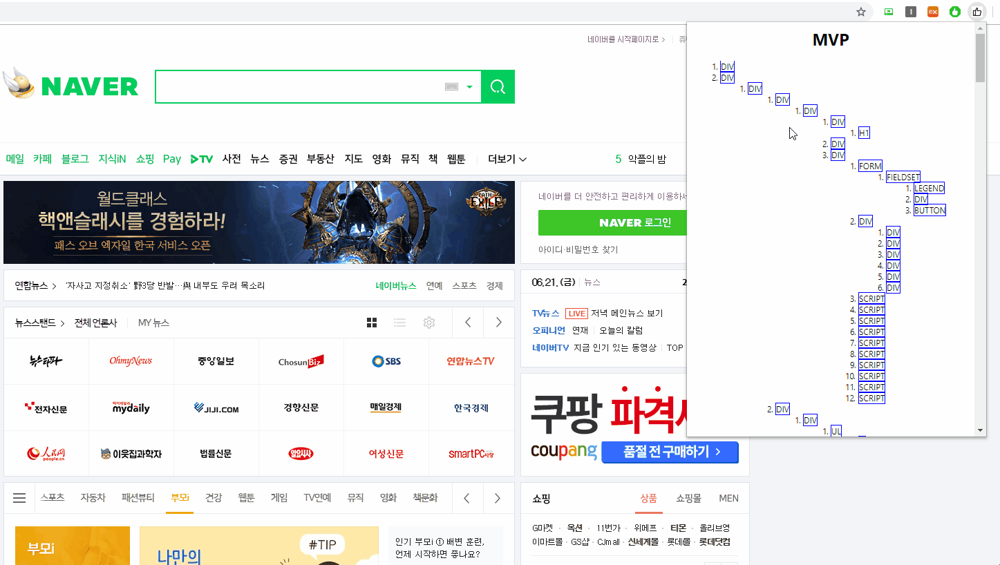
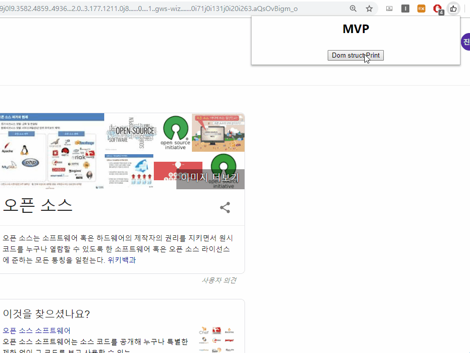

# team-project-team13
team-project-team13 created by GitHub Classroom

HTML Extractor
===
웹페이지의 dom 구조를 추출하여 사용자가 크롤링을 사용할 때 원하는 dom만 crawling 할 수 있게 selector를 추출해준다.

Install
---- 
1. 파일을 다운로드 받으세요
2. chorme 창을 켜고 오른쪽 상단 크롬 메뉴 중 '도구 더보기' -> '확장 프로그램'을 클릭하세요.
3. 오른쪽 상단에 개발자 모드를 키세요.
4. '압축해제된 확장 프로그램을 로드합니다.' 를 클릭하고, html_extract 디렉토리를 선택하세요.
5. 오른쪽 상단에 아이콘이 추가되면, 원하는 웹페이지에서 해당 아이콘을 클릭하세요.
6. spend 버튼을 누르면, 해당 페이지의 Dom 구조를 보여주줍니다.
7. 마우스로 해당 dom 구조에 올려놓으면, 해당 페이지에 해당되는 backgound color를 노란색으로 바꿔주고, 마우스를 때면, 원래색으로 바꿔줍니다.

Caution
----
1. 스르륵 하면 안됩니다. (마우스로 블록을 연속적으로 빠르게 할 경우 하이라이트 부분이 없어지지 않는 경우가 발생합니다.)

2. 하이라이트 부분이 없어지지 않고 프로그램을 재실행 했을 경우 그 부분이 노란색으로 되어 있는 경우가 발생합니다. 따라서 해당 문제가 발생했을 때 새로고침한 후 프로그램을 재실행하여 주세요.

3. 특정 페이지(ex.Google page)에서 Dom 추출이 너무 오래 걸려서 error가 난것처럼 동작하지 않아 보일 때가 있습니다.

Wish
---- 
1~2 : 해당 문제에 대해 해결책을 갖고 계신 분을 issue를 남겨주시거나 pull request를 보내주세요.

3 : 오래 걸릴 경우 최대 1분 이내에는 동작을 하게 됩니다. 기다려주세요.
